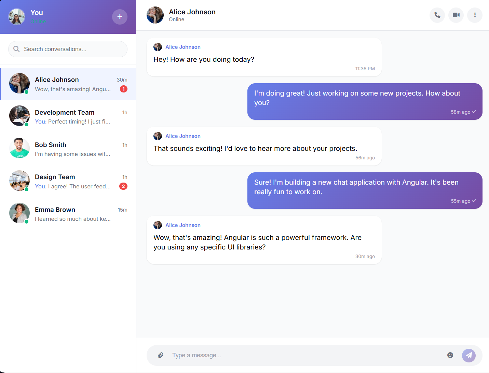

# ChatApp Frontend

A simple chat application frontend built using the Angular framework. This project is currently under development and only includes the frontend interface. No backend or real-time messaging functionality is implemented yet.

## Demo

## Tech Stack

- Angular
- HTML
- CSS
- JavaScript

## Future Features

- Backend integration for real-time messaging
- User authentication and registration
- Persistent chat history
- Group and private chat support
- Enhanced UI/UX improvements

---

*Project is actively being developed. Stay tuned for updates!*